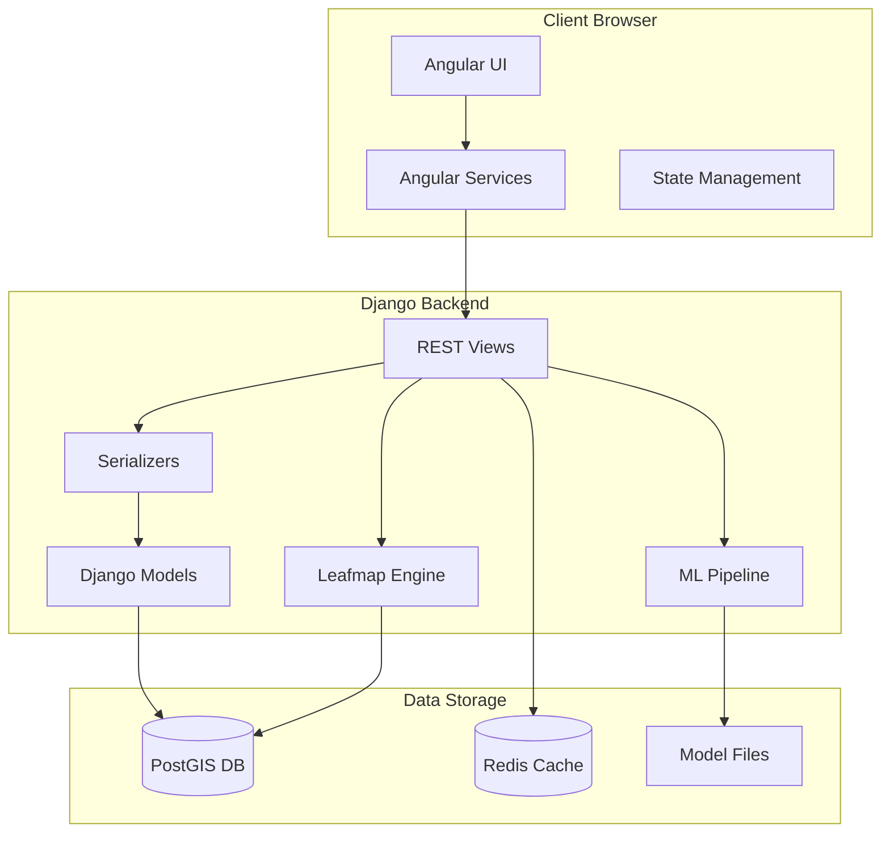
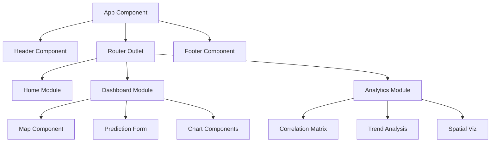
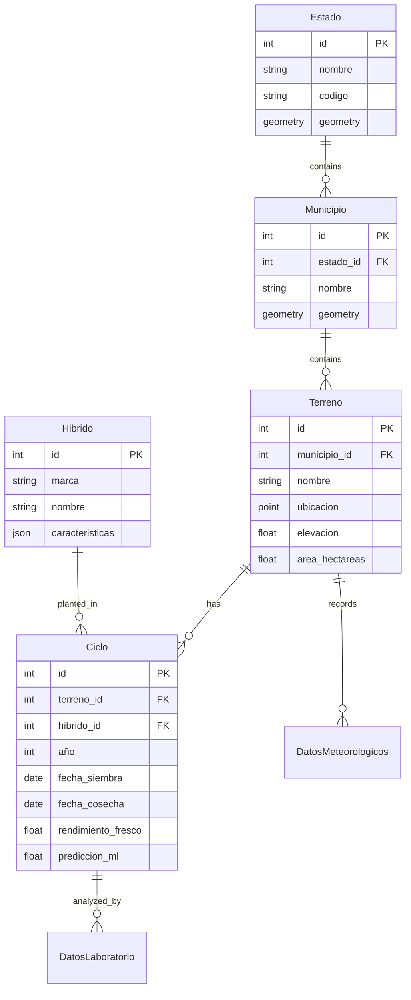
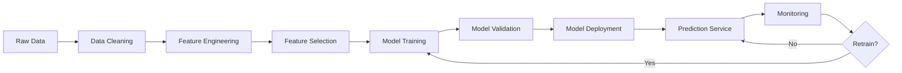

# CropAnalytics System Architecture

## Table of Contents

1. [Overview](#overview)
2. [System Architecture](#system-architecture)
3. [Backend Architecture](#backend-architecture)
4. [Frontend Architecture](#frontend-architecture)
5. [Database Design](#database-design)
6. [Machine Learning Pipeline](#machine-learning-pipeline)
7. [Leafmap Components](#leafmap-components)
8. [API Design](#api-design)
9. [Security Architecture](#security-architecture)
10. [Deployment Architecture](#deployment-architecture)

---

## Overview

CropAnalytics follows a **modern three-tier architecture** with clear separation of concerns, enabling scalability, maintainability, and independent development of components.

### Architectural Principles

- **Separation of Concerns**: Clear boundaries between presentation, business logic, and data layers
- **Modularity**: Independent, reusable components
- **Scalability**: Horizontal scaling capabilities
- **Maintainability**: Clean code structure with comprehensive documentation
- **Performance**: Optimized queries, caching, and lazy loading
- **Security**: Authentication, authorization, and data protection

---

## System Architecture

### High-Level Architecture Diagram

```
┌─────────────────────────────────────────────────────────────┐
│                        Client Layer                          │
│  ┌──────────────────────────────────────────────────────┐  │
│  │         Angular 21 Single Page Application           │  │
│  │  ┌────────────┐  ┌────────────┐  ┌────────────┐    │  │
│  │  │   Home     │  │ Dashboard  │  │ Analytics  │    │  │
│  │  └────────────┘  └────────────┘  └────────────┘    │  │
│  │  ┌────────────────────────────────────────────┐    │  │
│  │  │        Shared Components & Services        │    │  │
│  │  └────────────────────────────────────────────┘    │  │
│  └──────────────────────────────────────────────────────┘  │
└─────────────────────────────────────────────────────────────┘
                            │
                            │ HTTP/REST
                            ▼
┌─────────────────────────────────────────────────────────────┐
│                      Application Layer                       │
│  ┌──────────────────────────────────────────────────────┐  │
│  │              Django REST Framework API               │  │
│  │  ┌────────────┐  ┌────────────┐  ┌────────────┐    │  │
│  │  │   Views    │  │Serializers │  │   Routes   │    │  │
│  │  └────────────┘  └────────────┘  └────────────┘    │  │
│  └──────────────────────────────────────────────────────┘  │
│  ┌──────────────────────────────────────────────────────┐  │
│  │              Business Logic Layer                    │  │
│  │  ┌────────────┐  ┌────────────┐  ┌────────────┐    │  │
│  │  │ ML Engine  │  │  Leafmap   │  │  Weather   │    │  │
│  │  └────────────┘  └────────────┘  └────────────┘    │  │
│  └──────────────────────────────────────────────────────┘  │
└─────────────────────────────────────────────────────────────┘
                            │
                            │ ORM/SQL
                            ▼
┌─────────────────────────────────────────────────────────────┐
│                        Data Layer                            │
│  ┌──────────────────────────────────────────────────────┐  │
│  │         PostgreSQL 16 + PostGIS 3.4                  │  │
│  │  ┌────────────┐  ┌────────────┐  ┌────────────┐    │  │
│  │  │ Geographic │  │Agricultural│  │  Weather   │    │  │
│  │  │    Data    │  │    Data    │  │    Data    │    │  │
│  │  └────────────┘  └────────────┘  └────────────┘    │  │
│  └──────────────────────────────────────────────────────┘  │
│  ┌──────────────────────────────────────────────────────┐  │
│  │              ML Models Storage                       │  │
│  │         (Serialized scikit-learn models)             │  │
│  └──────────────────────────────────────────────────────┘  │
└─────────────────────────────────────────────────────────────┘
```

### Component Interaction Flow



---

## Backend Architecture

### Django Project Structure

```
backend/
├── core/                       # Project configuration
│   ├── __init__.py
│   ├── settings.py            # Django settings
│   ├── urls.py                # Root URL configuration
│   ├── wsgi.py                # WSGI entry point
│   └── asgi.py                # ASGI entry point
│
├── crops/                      # Main application (planned)
│   ├── models.py              # Data models
│   ├── views.py               # API views
│   ├── serializers.py         # DRF serializers
│   ├── urls.py                # App URLs
│   └── admin.py               # Admin interface
│
├── ml/                         # Machine Learning module (planned)
│   ├── models.py              # ML model classes
│   ├── features.py            # Feature engineering
│   ├── training.py            # Training pipeline
│   └── prediction.py          # Prediction service
│
├── leafmap/                    # Leafmap module (planned)
│   ├── spatial_analysis.py    # Spatial operations
│   ├── clustering.py          # Geographic clustering
│   └── interpolation.py       # Spatial interpolation
│
├── weather/                    # Weather integration (planned)
│   ├── openmeteo_client.py    # API client
│   └── processors.py          # Data processing
│
└── manage.py                   # Django management
```

### Key Backend Components

#### 1. Django Settings (`core/settings.py`)

**GeoDjango Configuration**:
```python
DATABASES = {
    'default': {
        'ENGINE': 'django.contrib.gis.db.backends.postgis',
        'NAME': 'crop_analytics',
        'USER': 'usuario_maiz',
        'PASSWORD': 'password_seguro_dev',
        'HOST': 'localhost',
        'PORT': '5432',
    }
}

INSTALLED_APPS = [
    'django.contrib.gis',      # GeoDjango
    'rest_framework',          # DRF
    'corsheaders',             # CORS support
]
```

**CORS Configuration**:
```python
CORS_ALLOWED_ORIGINS = [
    'http://localhost:4200',   # Angular dev server
    'http://127.0.0.1:4200',
]
```

#### 2. Data Models (Planned)

**Geographic Models**:
```python
class Estado(models.Model):
    nombre = models.CharField(max_length=100)
    codigo = models.CharField(max_length=10, unique=True)
    geometry = models.MultiPolygonField(srid=4326)

class Municipio(models.Model):
    nombre = models.CharField(max_length=100)
    estado = models.ForeignKey(Estado, on_delete=models.CASCADE)
    geometry = models.MultiPolygonField(srid=4326)

class Terreno(models.Model):
    nombre = models.CharField(max_length=200)
    municipio = models.ForeignKey(Municipio, on_delete=models.CASCADE)
    ubicacion = models.PointField(srid=4326)
    elevacion = models.FloatField()
    area_hectareas = models.FloatField()
```

**Agricultural Models**:
```python
class Hibrido(models.Model):
    marca = models.CharField(max_length=100)
    nombre = models.CharField(max_length=200)
    caracteristicas = models.JSONField(default=dict)

class Ciclo(models.Model):
    terreno = models.ForeignKey(Terreno, on_delete=models.CASCADE)
    hibrido = models.ForeignKey(Hibrido, on_delete=models.CASCADE)
    año = models.IntegerField()
    fecha_siembra = models.DateField()
    fecha_cosecha = models.DateField()
    # ... 50+ additional fields
    prediccion_ml_rendimiento = models.FloatField(null=True)
    confianza_prediccion = models.FloatField(null=True)
```

#### 3. REST API Views (Planned)

```python
class CicloViewSet(viewsets.ModelViewSet):
    queryset = Ciclo.objects.all()
    serializer_class = CicloSerializer
    
    @action(detail=False, methods=['post'])
    def predict_yield(self, request):
        """ML-powered yield prediction"""
        # Extract features
        # Run ML model
        # Return prediction with confidence
        pass
    
    @action(detail=False, methods=['get'])
    def spatial_analysis(self, request):
        """Spatial pattern analysis"""
        # Perform Leafmap analysis
        # Return GeoJSON results
        pass
```

---

## Frontend Architecture

### Angular Application Structure

```
frontend/src/app/
├── home/                       # Home module
│   ├── components/
│   │   ├── home/
│   │   └── background-border-shadow/
│   └── Home.routes.ts
│
├── dashboard/                  # Dashboard module
│   ├── components/
│   │   └── dashboard/
│   └── Dashboard.routes.ts
│
├── analytics/                  # Analytics module
│   ├── components/
│   │   ├── analytics/
│   │   ├── container/
│   │   ├── container1/
│   │   └── main/
│   └── Analytics.routes.ts
│
├── shared/                     # Shared components
│   └── components/
│       ├── header/
│       └── footer/
│
├── services/                   # Services (planned)
│   ├── api.service.ts
│   ├── ml-predictions.service.ts
│   ├── geo-analysis.service.ts
│   └── recommendations.service.ts
│
├── models/                     # TypeScript interfaces (planned)
│   ├── ciclo.model.ts
│   ├── prediction.model.ts
│   └── geojson.model.ts
│
├── app.routes.ts              # Route configuration
├── app.config.ts              # App configuration
└── app.ts                     # Root component
```

### Component Architecture



### Service Layer (Planned)

```typescript
// API Service - Base HTTP client
export class ApiService {
  constructor(private http: HttpClient) {}
  
  get<T>(endpoint: string): Observable<T> {}
  post<T>(endpoint: string, data: any): Observable<T> {}
}

// ML Predictions Service
export class MLPredictionsService {
  predictYield(conditions: PredictionInput): Observable<YieldPrediction> {}
  getFeatureImportance(): Observable<FeatureImportance[]> {}
}

// Geo Analysis Service
export class GeoAnalysisService {
  getProductionZones(hybridId: number): Observable<GeoJSON> {}
  getSpatialHotspots(variable: string): Observable<GeoJSON> {}
}

// Recommendations Service
export class RecommendationsService {
  recommendHybrid(terrainId: number): Observable<HybridRecommendation[]> {}
  optimizePlantingDate(terrainId: number): Observable<PlantingWindow> {}
}
```

### State Management

Currently using Angular signals for reactive state:

```typescript
export class App {
  protected readonly title = signal('frontend');
}
```

**Future Considerations**:
- NgRx for complex state management
- RxJS BehaviorSubjects for shared state
- Local storage for user preferences

---

## Database Design

### Entity Relationship Diagram



### Spatial Indexing

PostGIS spatial indexes for performance:

```sql
-- Spatial index on terreno locations
CREATE INDEX terreno_ubicacion_idx 
ON terreno USING GIST (ubicacion);

-- Spatial index on estado boundaries
CREATE INDEX estado_geometry_idx 
ON estado USING GIST (geometry);

-- Spatial index on municipio boundaries
CREATE INDEX municipio_geometry_idx 
ON municipio USING GIST (geometry);
```

### Data Partitioning Strategy

For large datasets, partition by year:

```sql
-- Partition ciclos table by year
CREATE TABLE ciclos_2024 PARTITION OF ciclos
FOR VALUES FROM (2024) TO (2025);

CREATE TABLE ciclos_2025 PARTITION OF ciclos
FOR VALUES FROM (2025) TO (2026);
```

---

## Machine Learning Pipeline

### ML Architecture



### Feature Engineering Pipeline

```python
class FeatureEngineer:
    def __init__(self):
        self.scaler = StandardScaler()
        self.feature_names = []
    
    def create_features(self, df):
        """Create all feature categories"""
        features = pd.DataFrame()
        
        # Temporal features
        features['day_of_year'] = df['fecha_siembra'].dt.dayofyear
        features['growing_days'] = (df['fecha_cosecha'] - df['fecha_siembra']).dt.days
        
        # Climate features
        features['temp_range'] = df['temp_max_ciclo'] - df['temp_min_ciclo']
        features['temp_variance'] = df.groupby('terreno_id')['temp_media_ciclo'].transform('std')
        
        # Interaction features
        features['temp_precip_interaction'] = df['temp_media_ciclo'] * df['precipitacion_ciclo']
        
        # Stress indices
        features['heat_stress_index'] = df['horas_sobre_30c'] / df['dias_siembra_cosecha']
        features['water_stress_index'] = 1 - (df['precipitacion_ciclo'] / df['precipitacion_anual'])
        
        return features
```

### Model Training Pipeline

```python
class ProductionPredictor:
    def __init__(self):
        self.models = {
            'svm': SVR(kernel='rbf', C=100, gamma=0.1),
            'rf': RandomForestRegressor(n_estimators=100, max_depth=20),
            'gbm': GradientBoostingRegressor(n_estimators=100, learning_rate=0.1)
        }
        self.weights = None
        self.scaler = StandardScaler()
    
    def train(self, X, y):
        """Train ensemble with cross-validation"""
        X_scaled = self.scaler.fit_transform(X)
        
        # Train each model
        predictions = {}
        for name, model in self.models.items():
            model.fit(X_scaled, y)
            predictions[name] = cross_val_predict(model, X_scaled, y, cv=5)
        
        # Learn optimal weights
        self.weights = self._optimize_weights(predictions, y)
        
    def predict(self, X):
        """Weighted ensemble prediction"""
        X_scaled = self.scaler.transform(X)
        predictions = []
        
        for name, model in self.models.items():
            pred = model.predict(X_scaled)
            predictions.append(pred * self.weights[name])
        
        return np.sum(predictions, axis=0)
```

### Model Evaluation

```python
def evaluate_model(y_true, y_pred):
    """Comprehensive model evaluation"""
    metrics = {
        'r2': r2_score(y_true, y_pred),
        'rmse': np.sqrt(mean_squared_error(y_true, y_pred)),
        'mae': mean_absolute_error(y_true, y_pred),
        'mape': np.mean(np.abs((y_true - y_pred) / y_true)) * 100
    }
    return metrics
```

---

## Leafmap Components

### Spatial Analysis Architecture

```python
class SpatialAnalyzer:
    def __init__(self):
        self.gdf = None
    
    def calculate_morans_i(self, variable):
        """Spatial autocorrelation analysis"""
        from esda.moran import Moran
        w = weights.Queen.from_dataframe(self.gdf)
        moran = Moran(self.gdf[variable], w)
        return {
            'I': moran.I,
            'p_value': moran.p_sim,
            'z_score': moran.z_sim
        }
    
    def hotspot_analysis(self, variable):
        """Getis-Ord Gi* statistic"""
        from esda.getisord import G_Local
        w = weights.Queen.from_dataframe(self.gdf)
        g_local = G_Local(self.gdf[variable], w)
        return g_local.Zs  # Z-scores for each location
    
    def kriging_interpolation(self, points, values, grid):
        """Spatial interpolation using kriging"""
        from pykrige.ok import OrdinaryKriging
        OK = OrdinaryKriging(
            points[:, 0], points[:, 1], values,
            variogram_model='spherical'
        )
        z, ss = OK.execute('grid', grid[0], grid[1])
        return z
```

### Production Zone Clustering

```python
class ProductionZoneAnalyzer:
    def identify_zones(self, gdf, n_clusters=5):
        """Cluster similar production regions"""
        from sklearn.cluster import KMeans
        
        # Extract features
        features = gdf[['rendimiento_materia_seca', 'elevacion', 
                       'temp_media_ciclo', 'precipitacion_ciclo']]
        
        # Cluster
        kmeans = KMeans(n_clusters=n_clusters)
        gdf['zone'] = kmeans.fit_predict(features)
        
        return gdf
```

---

## API Design

### RESTful Endpoint Structure

```
/api/v1/
├── estados/                    # Geographic entities
│   ├── GET    /               # List all states
│   ├── GET    /{id}/          # Get state details
│   └── GET    /{id}/municipios/  # Get municipalities in state
│
├── terrenos/                   # Land plots
│   ├── GET    /               # List all plots
│   ├── POST   /               # Create new plot
│   ├── GET    /{id}/          # Get plot details
│   └── GET    /{id}/ciclos/   # Get cycles for plot
│
├── ciclos/                     # Growing cycles
│   ├── GET    /               # List all cycles
│   ├── POST   /               # Create new cycle
│   ├── GET    /{id}/          # Get cycle details
│   ├── POST   /predict_yield/ # ML prediction
│   └── GET    /spatial_analysis/  # Spatial patterns
│
├── recommendations/            # ML recommendations
│   ├── POST   /recommend_hybrid/  # Hybrid selection
│   ├── POST   /optimize_planting/ # Planting date
│   └── GET    /similar_conditions/  # Similar cycles
│
└── geo/                        # Leafmap analysis
    ├── GET    /production_zones/  # Zone mapping
    ├── POST   /interpolate/       # Spatial interpolation
    └── GET    /hotspots/          # Hotspot analysis
```

### Request/Response Examples

**Yield Prediction Request**:
```json
POST /api/v1/ciclos/predict_yield/
{
  "terreno_id": 1,
  "hibrido_id": 2,
  "fecha_siembra": "2026-04-15",
  "condiciones_esperadas": {
    "temp_media_ciclo": 22.5,
    "precipitacion_ciclo": 450,
    "radiacion_solar": 18.5
  }
}
```

**Yield Prediction Response**:
```json
{
  "prediction": {
    "rendimiento_materia_seca": 18.5,
    "confidence_interval": [17.2, 19.8],
    "confidence_score": 0.92
  },
  "feature_importance": [
    {"feature": "temp_media_ciclo", "importance": 0.25},
    {"feature": "precipitacion_ciclo", "importance": 0.22},
    {"feature": "radiacion_solar", "importance": 0.18}
  ],
  "similar_cycles": [
    {"id": 45, "similarity": 0.95},
    {"id": 78, "similarity": 0.91}
  ]
}
```

---

## Security Architecture

### Authentication & Authorization

**Planned Implementation**:
- JWT tokens for API authentication
- Role-based access control (RBAC)
- Django permissions system

```python
# settings.py
REST_FRAMEWORK = {
    'DEFAULT_AUTHENTICATION_CLASSES': [
        'rest_framework_simplejwt.authentication.JWTAuthentication',
    ],
    'DEFAULT_PERMISSION_CLASSES': [
        'rest_framework.permissions.IsAuthenticated',
    ],
}
```

### Data Protection

- HTTPS/TLS for all communications
- Environment variables for secrets
- Database encryption at rest
- Input validation and sanitization
- CORS configuration for frontend access

---

## Deployment Architecture

### Development Environment

```yaml
# docker-compose.yml
services:
  db:
    image: postgis/postgis:16-3.4
    ports: ["5432:5432"]
    volumes: [postgres_data:/var/lib/postgresql/data]
  
  pgadmin:
    image: dpage/pgadmin4
    ports: ["5050:80"]
    depends_on: [db]
```

### Production Architecture (Planned)

```
┌─────────────────────────────────────────┐
│          Load Balancer (Nginx)          │
└─────────────────────────────────────────┘
                    │
        ┌───────────┴───────────┐
        ▼                       ▼
┌──────────────┐        ┌──────────────┐
│  Frontend    │        │  Frontend    │
│  (Angular)   │        │  (Angular)   │
└──────────────┘        └──────────────┘
        │                       │
        └───────────┬───────────┘
                    ▼
        ┌───────────────────────┐
        │   API Gateway         │
        └───────────────────────┘
                    │
        ┌───────────┴───────────┐
        ▼                       ▼
┌──────────────┐        ┌──────────────┐
│  Django API  │        │  Django API  │
│  (Gunicorn)  │        │  (Gunicorn)  │
└──────────────┘        └──────────────┘
        │                       │
        └───────────┬───────────┘
                    ▼
        ┌───────────────────────┐
        │   Redis Cache         │
        └───────────────────────┘
                    │
                    ▼
        ┌───────────────────────┐
        │  PostgreSQL + PostGIS │
        │  (Primary + Replica)  │
        └───────────────────────┘
```

### Kubernetes Deployment (Planned)

```yaml
# Deployment structure
- Namespace: crop-analytics
- Deployments:
  - frontend (3 replicas)
  - backend (3 replicas)
  - ml-service (2 replicas)
- Services:
  - frontend-service (LoadBalancer)
  - backend-service (ClusterIP)
  - postgres-service (StatefulSet)
- ConfigMaps & Secrets
- Persistent Volumes
```

---

## Performance Optimization

### Database Optimization

- Spatial indexes on geographic columns
- B-tree indexes on frequently queried fields
- Query optimization with `select_related()` and `prefetch_related()`
- Connection pooling
- Read replicas for analytics queries

### API Optimization

- Redis caching for frequent queries
- Response pagination
- Field filtering in serializers
- Async views for long-running operations
- Rate limiting

### Frontend Optimization

- Lazy loading of routes
- Virtual scrolling for large lists
- Image optimization
- Code splitting
- Service worker for offline support

---

## Monitoring & Logging

### Planned Monitoring Stack

- **Prometheus**: Metrics collection
- **Grafana**: Visualization dashboards
- **ELK Stack**: Log aggregation and analysis
- **Sentry**: Error tracking
- **New Relic**: Application performance monitoring

### Key Metrics to Monitor

- API response times
- Database query performance
- ML model prediction latency
- Error rates
- User activity patterns
- Resource utilization (CPU, memory, disk)

---

## Conclusion

This architecture provides a solid foundation for CropAnalytics, enabling:

- **Scalability**: Horizontal scaling of all components
- **Maintainability**: Clear separation of concerns
- **Performance**: Optimized queries and caching
- **Extensibility**: Modular design for new features
- **Reliability**: Redundancy and monitoring

The architecture supports the 6-month implementation plan and provides a path for future enhancements including mobile apps, real-time analytics, and additional crop types.

---

**Document Version**: 1.0  
**Last Updated**: June 2026  
**Status**: Active Development