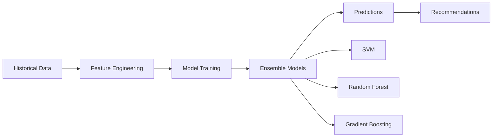
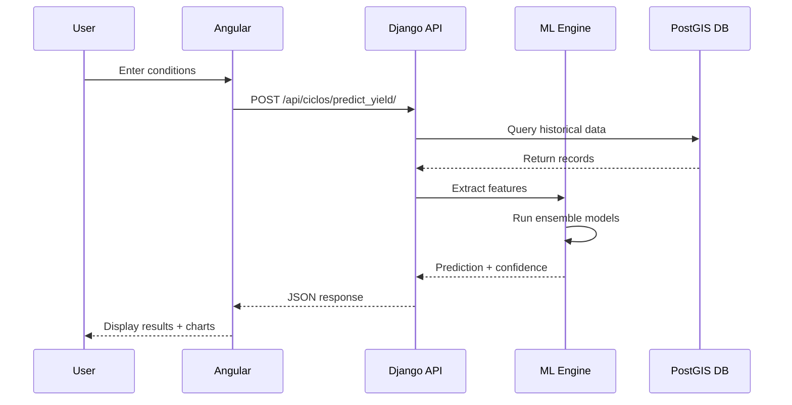
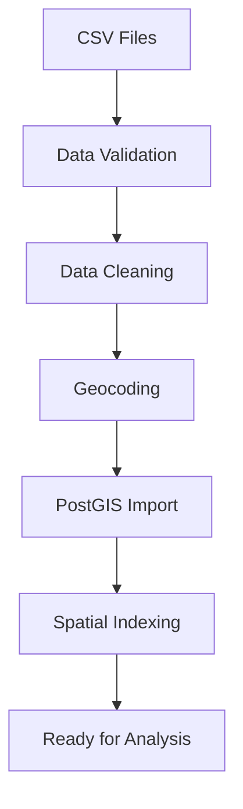

# CropAnalytics Project Documentation

## Overview

**CropAnalytics** is an advanced geospatial intelligence platform designed to optimize corn production through machine learning and Leafmap techniques. The system transforms from a basic milk production calculator into a comprehensive agricultural analytics platform that provides accurate yield predictions, spatial analysis, and actionable recommendations for regional farmers.

The platform integrates historical agricultural data with real-time weather information, geospatial analysis, and Support Vector Machine (SVM) models to predict crop yields, analyze production patterns, and recommend optimal farming strategies based on location, climate, and agronomic factors.

### Key Features

- 🌾 **Yield Prediction**: ML-powered predictions using 50+ variables
- 🗺️ **Geospatial Analysis**: Interactive maps with production zone identification
- 📊 **Advanced Analytics**: Multi-variate correlation and trend analysis
- 🎯 **Smart Recommendations**: Hybrid selection and optimal planting dates
- 🌤️ **Weather Integration**: Real-time and historical climate data
- 📈 **Quality Metrics**: Nutritional content and digestibility predictions

---

## Project Structure

```
IBM-summer-experience-26/
├── backend/                    # Django backend application
│   ├── core/                   # Project configuration
│   │   ├── settings.py        # Django settings with GeoDjango
│   │   ├── urls.py            # URL routing
│   │   └── wsgi.py            # WSGI configuration
│   ├── manage.py              # Django management script
│   └── requirements.txt       # Python dependencies
│
├── frontend/                   # Angular frontend application
│   ├── src/
│   │   ├── app/               # Application modules
│   │   │   ├── home/          # Home page module
│   │   │   ├── dashboard/     # Dashboard module
│   │   │   ├── analytics/     # Analytics module
│   │   │   └── shared/        # Shared components
│   │   ├── assets/            # Static assets (images, icons)
│   │   └── styles.css         # Global styles
│   ├── angular.json           # Angular configuration
│   ├── package.json           # Node dependencies
│   └── tailwind.config.js     # Tailwind CSS config
│
├── data/                       # CSV data files
│   ├── Ciclos.csv             # Growing cycle records
│   ├── Estados.csv            # State boundaries
│   ├── Hibridos.csv           # Corn hybrid varieties
│   ├── Laboratorio.csv        # Lab analysis results
│   ├── Municipios.csv         # Municipality data
│   ├── OpenMeteo.csv          # Weather observations
│   ├── Terrenos.csv           # Land plot data
│   └── README.md              # Data directory guide
│
├── docker-compose.yml          # Container orchestration
├── IMPLEMENTATION_PLAN.md      # Detailed implementation roadmap
├── PROJECT_DOCUMENTATION.md    # This file
├── ARCHITECTURE.md             # System architecture details
├── SETUP_GUIDE.md              # Installation instructions
├── API_REFERENCE.md            # API endpoint documentation
├── CONTRIBUTING.md             # Development guidelines
└── README.md                   # Project overview
```

---

## Technology Stack

### Backend Technologies

| Technology | Version | Purpose |
|------------|---------|---------|
| Python | 3.11+ | Programming language |
| Django | 6.0.2 | Web framework |
| GeoDjango | 6.0.2 | Spatial data extension |
| Django REST Framework | 3.16.1 | API development |
| PostgreSQL | 16 | Relational database |
| PostGIS | 3.4 | Spatial database extension |
| scikit-learn | 1.5.0 | Machine learning |
| GeoPandas | 0.14.0 | Geospatial data analysis |

### Frontend Technologies

| Technology | Version | Purpose |
|------------|---------|---------|
| Angular | 21.1.0 | Frontend framework |
| TypeScript | 5.9.2 | Programming language |
| Tailwind CSS | 4.1.12 | Styling framework |
| RxJS | 7.8.0 | Reactive programming |
| Leaflet | 1.9.4 (planned) | Interactive maps |
| Chart.js | 4.4.0 (planned) | Data visualization |

### Infrastructure

| Technology | Purpose |
|------------|---------|
| Docker | Containerization |
| Docker Compose | Multi-container orchestration |
| pgAdmin | Database management UI |
| Nginx | Reverse proxy (production) |
| Kubernetes | Container orchestration (production) |

---

## Core Concepts

### 1. Data Variables

The system analyzes **50+ agricultural variables** organized into categories:

#### Temporal & Location Data
- Year, location coordinates, elevation
- Planting and harvest dates
- Growing season duration

#### Climate Variables
- Temperature (annual and seasonal averages, min/max)
- Precipitation (annual and growing season)
- Solar radiation
- Growing degree days
- Heat stress indicators

#### Plant Development Metrics
- Seed planting density
- Emergence percentage
- Flowering timing
- Harvest plant count

#### Yield & Quality Metrics
- Fresh and dry matter yield
- Nutritional composition (protein, fiber, fat, ash)
- Carbohydrate content
- Digestibility at 24h, 30h, 48h
- Stalk health

### 2. Machine Learning Pipeline



**Feature Engineering**:
- Temporal features (day of year, season length)
- Geospatial features (elevation, slope, aspect)
- Climate aggregates (mean, variance, extremes)
- Interaction terms (temperature × precipitation)
- Stress indices (heat stress, water stress)

**Model Architecture**:
- **Primary**: Support Vector Regression (RBF kernel)
- **Ensemble**: Random Forest + Gradient Boosting
- **Weighting**: Learned weights based on validation performance

**Target Metrics**:
- Yield prediction: R² > 0.85, RMSE < 1.5 t/ha
- Quality prediction: R² > 0.80 per component
- Spatial accuracy: Moran's I > 0.6

### 3. Leafmap Components

**Spatial Analysis**:
- **Moran's I**: Measure spatial autocorrelation
- **Hotspot Analysis**: Identify high/low production clusters
- **Kriging**: Interpolate values for unmeasured locations
- **Terrain Analysis**: Calculate slope, aspect, watersheds

**Production Zones**:
- Cluster similar performing regions
- Identify optimal locations for specific hybrids
- Map environmental suitability

### 4. API Architecture

RESTful API with the following endpoint categories:

- **Geographic**: States, municipalities, land plots
- **Agricultural**: Hybrids, growing cycles
- **Predictions**: Yield forecasts, quality estimates
- **Recommendations**: Hybrid selection, planting dates
- **Spatial**: Production zones, interpolation
- **Weather**: Historical and forecast data

---

## Data Flow

### User Prediction Request



### Data Loading Process



---

## Key Metrics

### Performance Targets

| Metric | Target | Current |
|--------|--------|---------|
| Yield Prediction R² | > 0.85 | TBD |
| API Response Time | < 200ms | TBD |
| Map Load Time | < 2s | TBD |
| Prediction Time | < 1s | TBD |
| System Uptime | > 99.5% | TBD |

### Business Targets

| Metric | Target |
|--------|--------|
| Prediction Accuracy | Within 10% of actual |
| User Adoption | 80% of farmers |
| Yield Improvement | 15% increase |
| Input Cost Reduction | 20% decrease |
| User Satisfaction | > 4.5/5 rating |

---

## Development Phases

### Phase 1: Foundation (Weeks 1-4) ✅
- Database schema with spatial support
- Data import scripts
- Basic CRUD operations
- Spatial indexing

### Phase 2: ML Infrastructure (Weeks 5-8) 🔄
- Feature engineering pipeline
- Model development (SVM, RF, GBM)
- Training and validation framework
- Model serialization

### Phase 3: API Development (Weeks 9-12) 📋
- REST API endpoints
- Prediction endpoints
- Recommendation engine
- Spatial analysis endpoints

### Phase 4: Frontend Enhancement (Weeks 13-16) 📋
- Interactive maps (Leaflet)
- Prediction interface
- Analytics dashboard
- Visualization components

### Phase 5: ML Training & Validation (Weeks 17-20) 📋
- Model training on full dataset
- Cross-validation
- Hyperparameter tuning
- Deployment pipeline

### Phase 6: Advanced Features (Weeks 21-24) 📋
- Weather API integration
- Satellite imagery (NDVI)
- Mobile responsiveness
- Production deployment

---

## Getting Started

For detailed setup instructions, see [SETUP_GUIDE.md](SETUP_GUIDE.md).

**Quick Start**:

```bash
# 1. Clone repository
git clone <repository-url>
cd IBM-summer-experience-26

# 2. Start infrastructure
docker-compose up -d

# 3. Setup backend
cd backend
pip install -r requirements.txt
python manage.py migrate
python manage.py runserver

# 4. Setup frontend
cd frontend
npm install
npm start
```

**Access Points**:
- Frontend: http://localhost:4200
- Backend API: http://localhost:8000/api/
- Django Admin: http://localhost:8000/admin/
- pgAdmin: http://localhost:5050

---

## Documentation Index

- **[ARCHITECTURE.md](ARCHITECTURE.md)**: Detailed system architecture and design patterns
- **[SETUP_GUIDE.md](SETUP_GUIDE.md)**: Step-by-step installation and configuration
- **[API_REFERENCE.md](API_REFERENCE.md)**: Complete API endpoint documentation
- **[CONTRIBUTING.md](CONTRIBUTING.md)**: Development guidelines and best practices
- **[IMPLEMENTATION_PLAN.md](IMPLEMENTATION_PLAN.md)**: Comprehensive 6-month roadmap

---

## Support & Contact

For questions, issues, or contributions:

1. Check existing documentation
2. Review [IMPLEMENTATION_PLAN.md](IMPLEMENTATION_PLAN.md) for detailed specifications
3. Consult [API_REFERENCE.md](API_REFERENCE.md) for endpoint details
4. See [CONTRIBUTING.md](CONTRIBUTING.md) for development guidelines

---

## License

[Specify license information]

---

**Project**: IBM Summer Experience 2026  
**Status**: Active Development  
**Last Updated**: June 2026  
**Version**: 1.0.0